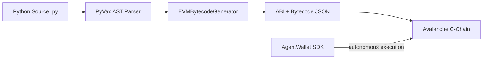

# PyVax — Smart Contracts for Agents

**Write pure Python. Deploy verified smart contracts on Avalanche C-Chain. No Solidity required.**

[](https://github.com/ShahiTechnovation/pyvax-rebrand/releases)
[](https://github.com/ShahiTechnovation/pyvax-rebrand)
[](https://github.com/ShahiTechnovation/pyvax-rebrand)
[](https://github.com/ShahiTechnovation/pyvax-rebrand)
[](https://www.avax.network)
[](https://www.pyvax.xyz/playground)

```bash
pip install pyvax
pyvax new my-agent-vault --template AgentVault
pyvax compile
pyvax deploy AgentVault --chain fuji
```

> **Try it in the browser — no installation needed:** [pyvax.xyz/playground](https://www.pyvax.xyz/playground)

---

## What is PyVax?

PyVax is a Python-to-EVM compiler toolchain that transpiles standard Python classes into optimized EVM bytecode deployable on Avalanche C-Chain. It is built for the next generation of onchain applications: **AI agents, autonomous game economies, and multi-agent DeFi** — where developers think in Python, not Solidity.

```python
from pyvax import Contract, action, agent_action, human_action

class AgentVault(Contract):
    balances: dict = {}
    total_deposits: int = 0

    @action
    def deposit(self, amount: int):
        """Any wallet can deposit"""
        self.require(amount > 0, "Amount must be positive")
        sender = self.msg_sender()
        self.balances[sender] = self.balances.get(sender, 0) + amount
        self.total_deposits = self.total_deposits + amount
        self.emit("Deposit", sender, amount)

    @agent_action
    def autonomous_rebalance(self):
        """Only verified AI agent wallets can call this"""
        pass

    @human_action
    def withdraw(self, amount: int):
        """Only human wallets — agents cannot drain funds"""
        sender = self.msg_sender()
        self.require(self.balances.get(sender, 0) >= amount, "Insufficient balance")
        self.balances[sender] = self.balances[sender] - amount
        self.emit("Withdraw", sender, amount)
```

```bash
pyvax compile
# ✔ Parsed syntax mapping
# ✔ AST generation successful
# => build/AgentVault.json (ABI + Bytecode)

pyvax deploy AgentVault --chain fuji
# ✓ Live at 0x4a2f3e2b1c8f... · Gas: 312,048
```

---

## Architecture



The transpiler parses your Python via the built-in `ast` module and emits raw EVM opcodes directly — **no Python interpreter is ever deployed on-chain.**

---

## Installation

```bash
pip install pyvax
```

**Requirements:** Python 3.9+

Verify your environment:

```bash
$ pyvax doctor

PyVax Environment Diagnostic

🟢 Node Runtime      [v20.11.1]
🟢 Python SDK        [v3.12.0]
🟢 @pyvax/cli        [v0.3.0]
🟢 Avalanche Fuji    [Connected - ping: 32ms]

Everything looks beautiful. Ready for transpile.
```

---

## Quick Start

```bash
# 1. Scaffold a new project
pyvax new my-vault --template AgentVault --chain fuji
cd my-vault

# 2. Create an agent wallet
pyvax wallet new deployer

# 3. Compile your Python contracts
pyvax compile --optimizer=3

# 4. Deploy to Avalanche Fuji Testnet
pyvax deploy AgentVault --chain fuji

# 5. Call your contract
pyvax call <deployed-address> deposit --args 1000

# 6. Check what was deployed
pyvax info AgentVault
```

---

## Core Features

### 🐍 Python-Native Smart Contracts

Write standard, valid Python with type hints. The transpiler maps Python directly to EVM storage and opcodes:

```python
from pyvax import Contract, action

class ERC20(Contract):
    # Type-annotated class vars → EVM storage slots
    total_supply: int = 0
    balances: dict = {}      # dict → mapping(address => uint256)
    allowances: dict = {}
    decimals_: int = 18

    @action
    def transfer(self, to: str, amount: int):
        sender = self.msg_sender()
        self.require(self.balances.get(sender, 0) >= amount, "Insufficient balance")
        self.balances[sender] = self.balances[sender] - amount
        self.balances[to] = self.balances.get(to, 0) + amount
        self.emit("Transfer", sender, to, amount)
```

### 🤖 Agent Access Control Decorators

PyVax introduces a three-tier permission system enforced at the EVM level:

| Decorator | Callable By | EVM Visibility | Use Case |
|-----------|-------------|----------------|----------|
| `@action` | All addresses (humans + agents) | External / Public | Deposits, transfers, reads |
| `@agent_action` | Verified autonomous wallets only | External | AI swaps, rebalancing, game logic |
| `@human_action` | Non-agent EOA addresses only | External | Withdrawals, admin, fund recovery |
| *(no decorator)* | Contract-internal only | Internal | Helper functions, private logic |

This lets you build hybrid contracts where AI agents and humans share the same contract but have strictly segregated permissions — preventing agents from draining human funds and preventing humans from disrupting autonomous logic.

### 🔑 AgentWallet SDK

```python
from pyvax import AgentWallet

wallet = AgentWallet("trading-bot-v1")
wallet.fund(avax=0.5)

# Pre-flight simulates before signing — drops tx silently if it would revert
# Prevents gas loss from hallucinated or impossible agent actions
receipt = wallet.execute(
    target="0xVault123...",
    method="deposit",
    args=[1000]
)
print(receipt.gas_used)
```

Multi-agent swarms in Python:

```python
from multiprocessing import Pool

wallets = [AgentWallet(f"worker-{i}") for i in range(10)]

with Pool(10) as p:
    p.map(agent_worker_loop, wallets)
```

### 🧪 Testing — No Hardhat, No Docker

Test contracts with standard `pytest`. MockChain simulates the full EVM in-memory:

```python
from pyvax import MockChain
from contracts.AgentVault import AgentVault

def test_agent_guardrail():
    chain = MockChain()
    human, agent = chain.generate_wallets(2, balance=10.0)
    contract = chain.deploy(AgentVault)

    # Verify @agent_action blocks human wallets at EVM level
    with pytest.raises(chain.TransactionRevertedError):
        human.execute(contract, "autonomous_rebalance", [])
```

Or use the built-in CLI test runner:

```bash
pyvax test
# AgentVault  PASS  2.1kb  5 funcs  0.09s
# ERC20       PASS  1.8kb  4 funcs  0.07s
# Voting      PASS  1.4kb  3 funcs  0.06s
# All 5 test(s) passed!
```

### ⛓️ Chainlink VRF — One-Line Verifiable Randomness

```python
class LootBox(Contract):
    @action
    def open_loot(self, player: str):
        # Chainlink VRF Coordinator auto-bound on deploy
        rng_value = self.chainlink_vrf(max_value=100)
        rarity = self._determine_rarity(rng_value)
        self._mint(player, rarity, 1)
```

VRF Subscription ID binding is prompted automatically:

```bash
pyvax deploy LootBox --chain fuji
# Dependency detected: VRF Coordinator
# Please enter your Chainlink Subscription ID: 8492
# Binding VRF dependencies... Deploying.
```

### 🎮 ERC-1155 Game Assets

```python
class GameAssets(Contract):
    equipped: dict = {}

    @action
    def mint_material(self, player: str, material_id: int, qty: int):
        self._mint(player, material_id, qty)  # Fungible (gold, wood)

    @action
    def mint_weapon(self, player: str, weapon_id: int):
        self._mint(player, weapon_id, 1)       # Non-fungible (unique sword)
```

---

## Gas Optimizations (v0.3.0)

PyVax applies three compiler passes automatically — **~15% overall gas reduction**:

| Optimization | Mechanism | Savings |
|---|---|---|
| **Binary Search Dispatch** | O(log n) selector tree for contracts with >4 functions | Up to 62% per call on large contracts |
| **SLOAD Caching** | Cache repeated state reads in memory — CSE emulation | 2,100 → 3 gas on reads 2+ (99.9%) |
| **Peephole Optimizer** | Constant folding, double-negation elimination, revert deduplication | ~75 bytes per duplicate revert string |

Plus manual optimization tools:

```python
# Storage slot packing with typed hints
from pyvax import Uint8

class Optimized(Contract):
    # Packs into ONE 256-bit slot (vs three separate slots)
    health: Uint8 = 100
    is_alive: bool = True
    mana: Uint8 = 50
```

Optimizer levels: `--optimizer=0` (none) through `--optimizer=3` (aggressive)

### Benchmark: PyVax v0.3.0 vs Solidity vs Huff

| Metric | PyVax v0.3.0 | Solidity 0.8.27 | Huff 0.3 |
|---|---|---|---|
| Dispatch (16 funcs) | **88 gas** | 88 gas | 72 gas |
| SLOAD (3x same slot) | 106 gas | 100 gas | 100 gas |
| Revert Size (2 msgs) | 86 bytes | 72 bytes | N/A |
| Optimization | AST + Peephole | Yul IR + CSE | Direct Macros |

---

## CLI Reference

| Command | Description |
|---|---|
| `pyvax new <n> [--template T] [--chain fuji\|cchain]` | Scaffold project with contract template and config |
| `pyvax compile [Contract] [--optimizer 0-3] [--gas-report]` | Python → ABI + EVM bytecode |
| `pyvax deploy <Contract> [--chain fuji\|cchain] [--verify]` | Deploy to Avalanche |
| `pyvax call <address> <method> [--args ...] [--view]` | Interact with deployed contract |
| `pyvax test [Contract]` | Run compilation tests — no deployment needed |
| `pyvax wallet new <id> [--mnemonic]` | Generate encrypted HD agent wallet |
| `pyvax wallet show` | Show wallet address and status |
| `pyvax info <Contract>` | Show ABI and deployment metadata |
| `pyvax doctor` | Full environment + RPC health diagnostic |
| `pyvax config` | Show active network and RPC config |
| `pyvax version` | Show PyVax version |

### Deployment flags

```bash
pyvax deploy AgentVault \
  --chain cchain \        # fuji (default) | cchain
  --rpc https://... \     # override RPC endpoint
  --gas-limit 3000000 \   # override auto gas estimation
  --dry-run \             # simulate gas without deploying
  --verify \              # verify on Snowtrace after deploy
  --verbose               # print full EVM trace on failure
```

---

## Contract Templates

Scaffold any of these with `pyvax new <n> --template <T>`:

| Template | Description | Key Features |
|---|---|---|
| `AgentVault` | Production vault with agent/human permission split | `@agent_action`, `@human_action`, deposit/withdraw |
| `ERC20` | Standard fungible token | mint, transfer, balance_of, EIP-20 events |
| `Voting` | Decentralized voting | one-vote-per-address, candidate tallying |
| `Counter` | Minimal increment/decrement | overflow-safe arithmetic, reset, events |
| `SimpleStorage` | Single integer read/write | baseline benchmark contract |

---

## Writing Contracts — Rules

```python
from pyvax import Contract, action

class MyContract(Contract):
    stored: int = 0          # int    → uint256 storage slot
    owner: str = ""          # str    → address storage slot
    flags: dict = {}         # dict   → mapping(address => uint256)
    alive: bool = True       # bool   → bool storage slot

    @action
    def set(self, value: int):
        self.stored = value                        # overflow-safe
        self.emit("Updated", value)                # LOG opcode

    @action
    def guarded(self, amount: int):
        self.require(amount > 0, "Must be > 0")   # REVERT on fail
        sender = self.msg_sender()                 # CALLER opcode
        ts     = self.block_timestamp()            # TIMESTAMP opcode
        block  = self.block_number()               # NUMBER opcode
```

**Rules:**
1. Classes inheriting `Contract` compile to EVM smart contracts
2. `@action` → `public/external`. No decorator → `internal`
3. Type-annotated class variables → EVM storage slots
4. `msg_sender()`, `msg_value()`, `block_timestamp()`, `block_number()` are implicit globals
5. `self.require(cond, "msg")` → inline REVERT with ABI-encoded error
6. `self.emit("Event", arg1, arg2)` → LOG1–LOG4 opcodes

---

## Debugging

PyVax maps EVM revert traces back to Python source:

```bash
$ pyvax call 0xVault... withdraw_funds 900

# Trace Output
# Execute Failed: [TransactionRevertedError]
#
# File "vault.py", line 14, in withdraw_funds
#     self.balance[msg.sender] -= amount
#
# Error: Arithmetic Underflow. Attempted to subtract 900
# from current balance (100).
```

Run `pyvax doctor` at any time to verify environment health and RPC connectivity.

---

## Run the Demo

```bash
git clone https://github.com/ShahiTechnovation/pyvax-rebrand
cd pyvax-rebrand
pip install -e .
bash demo.sh
```

The demo scaffolds a project, compiles with optimizer level 3, runs `pyvax doctor`, and validates build artifacts — no wallet or live deployment required.

---

## Project Structure

```
pyvax-rebrand/
├── avax_cli/
│   ├── transpiler.py      # Python AST → EVM bytecode (core compiler)
│   ├── cli.py             # Typer CLI — all commands
│   ├── compiler.py        # Multi-contract compilation pipeline
│   ├── deployer.py        # web3.py + EIP-1559 gas estimation
│   ├── wallet.py          # Encrypted HD keystore management
│   ├── interactor.py      # Contract read/write interaction
│   └── py_contracts.py    # Contract base class + decorators
├── app/                   # Next.js 14 web platform
├── playground/            # Browser compilation API (Railway)
├── content/docs/          # MDX documentation (20 articles)
├── tests/
│   ├── test_v3_optimizations.py   # Optimizer + gas validation
│   ├── test_pipeline.py           # End-to-end compile pipeline
│   ├── test_quick.py              # Smoke tests
│   └── test_sload_diag.py         # SLOAD cache diagnostics
├── test_AgentVault/       # AgentVault contract + deploy scripts
├── test_ERC20/            # ERC-20 contract + deploy scripts
├── test_Voting/           # Voting contract + deploy scripts
├── test_Counter/          # Counter contract + deploy scripts
├── test_SimpleStorage/    # SimpleStorage contract + deploy scripts
├── DemoToken/             # Demo ERC-20 deployment
├── demo.sh                # End-to-end demo script
├── setup.py               # pip install pyvax
└── pyproject.toml
```

---

## Playground

No installation needed. Write, compile, and deploy Python contracts in the browser:

**[pyvax.xyz/playground →](https://www.pyvax.xyz/playground)**

- Live Python editor with full decorator support
- Real-time ABI + EVM bytecode inspector
- In-browser `pyvax compile` terminal
- One-click Fuji testnet deployment via MetaMask

---

## Documentation

Full docs at **[pyvax.xyz/docs](https://www.pyvax.xyz/docs)**

| Section | Articles |
|---|---|
| Getting Started | [Quickstart](https://www.pyvax.xyz/docs/quickstart) · [Install](https://www.pyvax.xyz/docs/install) · [Playground](https://www.pyvax.xyz/docs/playground) · [First Contract](https://www.pyvax.xyz/docs/first-contract) |
| Core Reference | [CLI](https://www.pyvax.xyz/docs/cli) · [Python API](https://www.pyvax.xyz/docs/api) · [Contract Syntax](https://www.pyvax.xyz/docs/contracts) · [Deployment](https://www.pyvax.xyz/docs/deployment) |
| Agent Development | [Wallets](https://www.pyvax.xyz/docs/agents/wallets) · [Execution](https://www.pyvax.xyz/docs/agents/execution) · [Memory](https://www.pyvax.xyz/docs/agents/memory) · [Multi-Agent](https://www.pyvax.xyz/docs/agents/systems) |
| Games & Assets | [ERC-1155](https://www.pyvax.xyz/docs/games/assets) · [Loot/VRF](https://www.pyvax.xyz/docs/games/loot) · [Leaderboards](https://www.pyvax.xyz/docs/games/leaderboards) · [Economies](https://www.pyvax.xyz/docs/games/economies) |
| Advanced | [Custom RPCs](https://www.pyvax.xyz/docs/advanced/rpc) · [Gas](https://www.pyvax.xyz/docs/advanced/gas) · [Testing](https://www.pyvax.xyz/docs/advanced/testing) · [Debugging](https://www.pyvax.xyz/docs/advanced/debugging) |

---

## Built With

- [Avalanche C-Chain](https://www.avax.network) — primary deployment target
- [Chainlink VRF](https://chain.link/vrf) — verifiable randomness
- [web3.py](https://web3py.readthedocs.io) — EVM interaction layer
- [eth-account](https://eth-account.readthedocs.io) — HD wallet + transaction signing
- [Typer](https://typer.tiangolo.com) + [Rich](https://rich.readthedocs.io) — CLI framework
- [PyCryptodome](https://pycryptodome.readthedocs.io) — keccak256 hashing
- [Next.js 14](https://nextjs.org) — web platform

---

**Built with ❤️ for the Avalanche & Python ecosystems.**

*Submitted to [Avalanche Build Games 2026](https://build.avax.network/build-games)*
