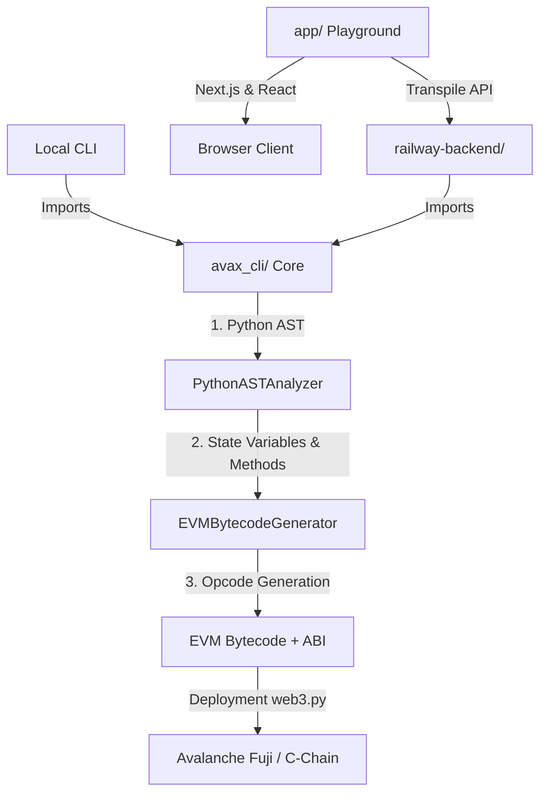

# PyVax Codebase Analysis

## 1. Executive Summary
PyVax is a full-stack developer toolchain and web platform designed to compile standard Python code directly into Ethereum Virtual Machine (EVM) bytecode for the Avalanche C-Chain. The primary goal is to provide a "Solidity-free" smart contract development environment natively tailored for autonomous agents and on-chain AI interactions.

The repository integrates:
1. A raw Python-to-EVM Compiler (`avax_cli`).
2. A comprehensive CLI tool (`pyvax-cli`).
3. A Next.js 14 web platform featuring a browser-based IDE Playground, full developer documentation, and promotional materials.
4. A deployed FastAPI Backend (`railway-backend`) serving dynamic transpilation to the browser IDE.

## 2. Global Architecture

The architecture seamlessly spans local CLI usage and browser execution seamlessly over REST.

## 3. Deep Dive: `avax_cli` Core Compiler

`avax_cli` is the technical heart of the repository. It avoids using standard Python interpreters on chain. Instead, it statically analyzes Python code via the `ast` module and directly writes raw EVM opcodes (like `PUSH`, `SSTORE`, `SLOAD`, `JUMPI`).

### Key Modules:
- **`transpiler.py`**:
  - `PythonASTAnalyzer`: Iterates through the Python `.py` file, extracting decorators (`@action`, `@agent_action`, `@human_action`), identifying class variables (EVM Storage Slots), and capturing function scope.
  - `EVMBytecodeGenerator`: The core engine taking AST structures and recursively emitting byte arrays representing EVM instructions. It manages memory allocation, stack depth mapping, dynamic routing, ABI encoding/decoding, and jump destinations.
- **`compiler.py`**: A high-level pipeline wrapper calling `transpiler.py` on multiple contracts, optimizing them based on arguments (Levels 0-3), generating JSON ABI schemas, and saving them into a `build/` directory format recognizable by Web3 frameworks.
- **`deployer.py` and `interactor.py`**: Leverage Python's `web3.py` to deploy the EVM raw hex strings to Avalanche chains, supporting custom EVM gas estimations and transaction signing.
- **`wallet.py`**: The `AgentWallet` class implements Encrypted HD Wallet logic to generate programmatic external owned accounts (EOA) suitable for bots mimicking autonomous agents.
- **`cli.py`**: Extends Python `Typer` to expose these functions directly to terminal developers (e.g., `pyvax compile`, `pyvax deploy`).

## 4. Deep Dive: Frontend Web Platform (`app/`)

Built with Next.js 14 App Router and completely "Solidity-free" marketing aesthetics.

- **`app/playground/`**: A browser-based IDE (similar to Remix). It provides syntax highlighting for Python via Monaco Editor. Due to browser limitations blocking raw Python sub-processes, it marshals the Python code as a payload to the deployed `railway-backend`.
- **`app/docs/`**: MDX-driven documentation detailing every piece of functionality.
- **`components/`**: Uses modern UI components customized with Tailwind (shadcn UI, Framer Motion for scroll/hover animations), prioritizing "glassmorphism", dark modes, and premium DevTool experiences.

## 5. Middleware/Backend: `railway-backend/`

Since transpilation requires native Python execution (AST inspection, memory buffers), the Next.js `app/api/...` acts as a proxy proxying to an external API (Railway).
- **`api_wrapper.py` & `main.py`**: A lightweight FastAPI wrapper running in Docker that listens to the IDE HTTP requests inside the NextJS app, streams it directly into `avax_cli.compiler`, and ships the compiled bytecode, gas profile, and ABI back out to the Javascript context.

## 6. Optimization Benchmarks & Strategies (v0.3.0)

The codebase highlights three advanced gas optimization passes that the AST-to-OpCode transpiler does natively under the hood:
1. **Binary Search Dispatcher**: For contracts >4 methods, traditional O(N) linear `IF / EQ / JUMP` logic transforms into an O(log N) split tree, massively cutting contract execution overhead.
2. **SLOAD Caching**: It mimics "Common Subexpression Elimination" by caching repetitive state reads (e.g., repeating `self.balances[xyz]`) into RAM, avoiding the 2100-gas cold-storage read cost.
3. **Peephole Optimizer**: Folding constants, eliminating redundant `ISZERO ISZERO` mappings, and aggregating duplicate revert strings back to singular memory blocks to compress execution footprint.

## 7. Testing & Verification (`tests/`)

- Includes unit and integration tests driven by `pytest` directly analyzing byte buffers (`test_v3_optimizations.py`, `test_pipeline.py`).
- Demonstrations (`demo.sh`, `DemoToken/`) validate end-to-end functionality via CLI execution mock validations, maintaining robust quality checks bridging local environment setups.
