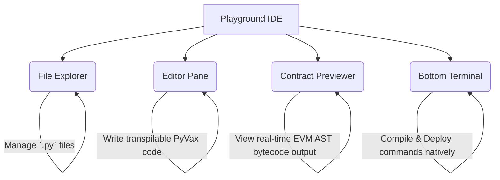

# Playground Tour

We've bundled the entire PyVax compilation pipeline into an [interactive WASM browser IDE](/playground) so you can rapidly prototype AI agents and smart contract architectures before installing any CLI dependencies locally. 

Our Playground IDE perfectly mimics **VS Code** with full multi-pane architecture tailored exclusively for Web3 development on the Avalanche network.

## The Interface Layout

### 1. The Python Editor
Write standardized Python code taking advantage of natively integrated decorators like `@action` and `@agent_action`. 

### 2. ABI Bytecode Inspector 
The far-right pane continuously auto-compiles your standard Python functions into EVM Bytecode, exposing the exact ABI schema alongside the parsed hex output mapping your application to Avalanche consensus structures.

### 3. Integrated Mini-CLI
The terminal window in the bottom quadrant allows you to execute commands identical to the actual local binary (`pyvax compile` and `pyvax doctor`) without ever spinning up a virtual environment.

<Callout title="Zero-Installation Sandbox">
The PyVax playground is ideal for hackathons or validating rapid multi-agent scenarios natively inside your browser. No Docker, no Python venv, no NodeJS.
</Callout>
